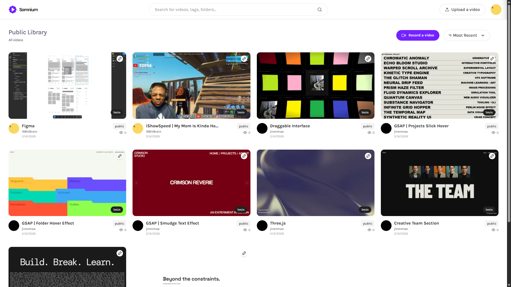

# Full Stack Screen Recording & Video Sharing Platform

A modern full-stack application for recording your screen, uploading videos, generating AI transcripts, and sharing content securely with full privacy control.



---

## Features

| Feature                | Description |
|------------------------|-------------|
| Authentication         | Secure user sign-up and sign-in with Better Auth and Google OAuth. |
| Screen Recording       | Record your screen directly inside the browser with a seamless experience. |
| Video Uploading        | Upload videos easily with support for public and private visibility. |
| AI Transcripts         | Generate automatic transcripts for better accessibility and search. |
| Privacy Control        | Toggle video access between public and private anytime. |
| Arcjet Security        | Protect the app with bot detection, rate limiting, and attack prevention. |
| Share Videos           | Share uploaded videos instantly using unique links. |
| Modern UI/UX           | Minimal, responsive design built with Tailwind CSS. |
| Database Integration   | Real-time scalable database management powered by Xata. |
| Type-Safe Queries      | Reliable and secure database queries using Drizzle ORM. |
| Cross-Device Ready     | Fully responsive experience across desktop, tablet, and mobile. |

---

## Tech Stack

| Technology    | Official Website |
|--------------|----------------|
| Next.js       | https://nextjs.org/ |
| TypeScript    | https://www.typescriptlang.org/ |
| Tailwind CSS   | https://tailwindcss.com/ |
| Better Auth    | https://www.better-auth.com/ |
| Bunny.net  (14 days trial)  | https://bunny.net/ |
| Xata      (14 days trial)     | https://xata.io/ |
| Drizzle ORM    | https://orm.drizzle.team/ |
| Arcjet  (14 days trial)      | https://arcjet.com/ |

---

### Clone the repository

```bash
git clone https://github.com/jirenmaa/Somnium
```

Copy the content `.env.example` file to `.env` in the root directory

```env
# Next.js
NEXT_PUBLIC_BASE_URL=http://localhost:3000

# Xata Configuration
XATA_API_KEY=
DATABASE_URL_POSTGRES=

# Google OAuth
GOOGLE_CLIENT_ID=
GOOGLE_CLIENT_SECRET=

# Better Auth
BETTER_AUTH_SECRET=
BETTER_AUTH_URL=http://localhost:3000

# Bunny.net
BUNNY_STORAGE_ACCESS_KEY=
BUNNY_LIBRARY_ID=
BUNNY_STREAM_ACCESS_KEY=

# Arcjet
ARCJET_API_KEY=
```


## Install dependencies

```bash
npm install
```

Open [http://localhost:3000](http://localhost:3000) in your browser to view the project.
